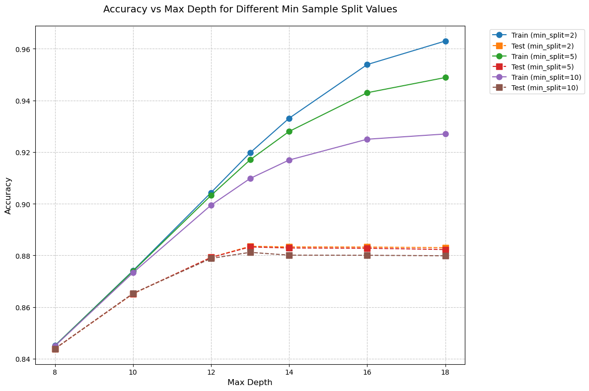

# Decision Tree From Scratch

This project implements a Decision Tree Classifier from scratch and applies it to predict hotel booking cancellations using the Hotel Booking Demand dataset. The implementation was developed as part of the Introduction to Artificial Intelligence course at Iran University of Science and Technology (IUST).

## Project Overview

- Custom implementation of Decision Tree Classifier
- Applied to Hotel Booking Demand dataset
- Predicts whether a hotel booking will be canceled
- Achieved 89% accuracy on the test set

## Features

- Decision Tree implementation with customizable parameters:
  - Minimum samples for split
  - Maximum depth
  - Number of splits
- Supports both binary and multi-class classification
- Includes tree visualization functionality
- Handles numerical features

## Results

Our model achieved strong performance metrics:
- Test Accuracy: 89%
- Training Accuracy: 91.8%
- Balanced handling of both canceled and non-canceled bookings

## Implementation Details

The Decision Tree Classifier includes:
- Information gain-based splitting
- Recursive tree building
- Customizable stopping criteria
- Prediction functionality for both single and multiple samples

## Dataset

The Hotel Booking Demand dataset contains bookings for two hotels with various features including:
- Lead time
- Arrival date details
- Stay duration
- Previous booking history
- Guest demographics

## Requirements

- Python 3.x
- NumPy
- Pandas
- Matplotlib
- Seaborn
- Scikit-learn (for comparison purposes)
- Graphviz (for graphing the Tree)

## Author

Javad Pourrafi - Iran University of Science and Technology